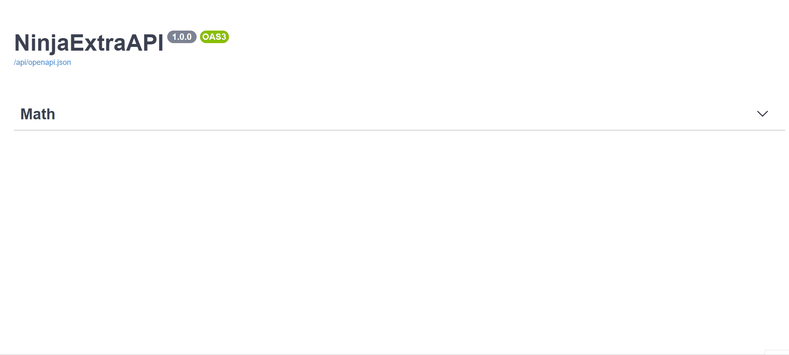

[](https://badge.fury.io/py/django-ninja-extra)
[](https://pypi.python.org/pypi/django-ninja-extra)
[](https://pypi.python.org/pypi/django-ninja-extra)
[](https://pypi.python.org/pypi/django-ninja-extra)
[](https://codecov.io/gh/eadwinCode/django-ninja-extra)
[](https://pepy.tech/project/django-ninja-extra)

# Django Ninja Extra 文档

**Django Ninja Extra** 提供了一种 **基于类** 的方法以及额外的功能，这将使用 [**Django Ninja**](https://django-ninja.cn) 加速您的 RESTful API 开发。

**主要特点:**

全部的 **Django-Ninja** 特性 :

- **简单**: 设计为易于使用和符合直觉。
- **快速的执行速度**: 多亏了 **<a href="https://pydantic-docs.helpmanual.io" target="_blank">Pydantic</a>** 和 **<a href="/async-support/">async 异步支持</a>， 具有非常高的性能。**
- **快速的编码**: 类型提示和自动文档让你只需专注于业务逻辑。
- **基于标准**: 基于标准: **OpenAPI** (以前称为 Swagger) 和 **JSON 模式**。
- **对 Django 友好**: （显然）与 Django 核心和 ORM 有良好的集成。

加上 **Extra**:

- **基于类**: 以基于类的方式设计你的 API。
- **权限**: 通过在路由级别或控制器级别定义的权限和认证轻松保护访问接口。
- **依赖注入**: 控制器类支持使用 Python [**Injector** ](https://injector.readthedocs.io/en/latest/) 或者 [**django_injector**](https://github.com/blubber/django_injector)。让你能够将 API 依赖服务注入到 APIController 类中，并在需要的地方使用它们。

---

### 版本依赖
- Python >= 3.6
- django >= 2.1 
- pydantic >= 1.6 
- Django-Ninja >= 0.16.1


完整文档， [访问此链接](https://django-ninja.cn/django-ninja-extra/)。

## 安装

```
pip install django-ninja-extra
```
安装后, 将 `ninja_extra` 添加到你的 `INSTALLED_APPS` 中

```Python 
INSTALLED_APPS = [
    ...,
    'ninja_extra',
]
```

## 使用

在你的 Django 项目中，在 urls.py 旁边创建新的 `api.py` 文件:

```Python
from ninja_extra import NinjaExtraAPI, api_controller, http_get

api = NinjaExtraAPI()

# 基于函数的定义
@api.get("/add", tags=['Math'])
def add(request, a: int, b: int):
    return {"result": a + b}

# 基于类的定义
@api_controller('/', tags=['Math'], permissions=[])
class MathAPI:

    @http_get('/subtract',)
    def subtract(self, a: int, b: int):
        """Subtracts a from b"""
        return {"result": a - b}

    @http_get('/divide',)
    def divide(self, a: int, b: int):
        """Divides a by b"""
        return {"result": a / b}
    
    @http_get('/multiple',)
    def multiple(self, a: int, b: int):
        """Multiples a with b"""
        return {"result": a * b}
    
api.register_controllers(
    MathAPI
)
```

现在转到 `urls.py` 并添加以下内容:

```Python
...
from django.urls import path
from .api import api

urlpatterns = [
    path("admin/", admin.site.urls),
    path("api/", api.urls),  # <---------- !
]
```

### 交互 API 文档

现在转到 <a href="http://127.0.0.1:8000/api/docs" target="_blank">http://127.0.0.1:8000/api/docs</a>

你将看到自动交互 API 文档 (由 <a href="https://github.com/swagger-api/swagger-ui" target="_blank">Swagger UI</a>提供):



## Tutorials
- [django-ninja - 使用 django-ninja-extra 的权限、控制器和节流！](https://www.youtube.com/watch?v=yQqig-c2dd4) -  学习如何使用 django-ninja-extra 的权限、控制器和节流
- [BookStore API](https://github.com/eadwinCode/bookstoreapi) - 一个示例项目，展示如何使用 django-ninja-extra 与 ninja 模式和 ninja-jwt


