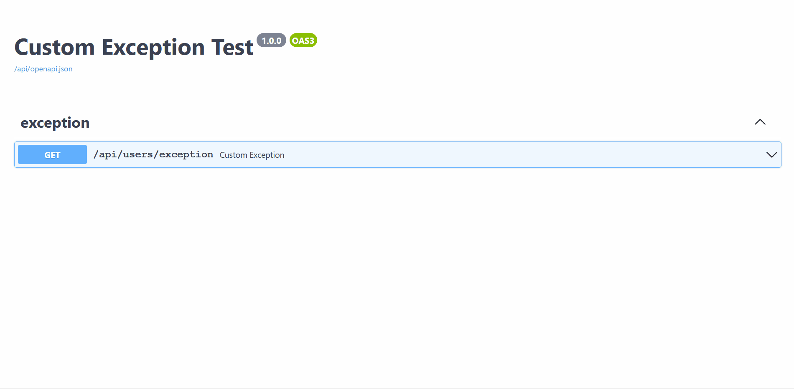

# **自定义异常**
**Django-Ninja** 通过针对异常类型注册一个函数 (handler) 来提供处理自定义异常的直观方式，就像在 Flask 应用中所做的那样。

从这个意义上说， **Django-Ninja-Extra** 有一个 `APIException` 异常类型， 它为那些习惯使用 DRF `APIException` 的人提供了类似的功能。

例如： 
```python
from ninja_extra.exceptions import APIException
from ninja_extra import api_controller, route, NinjaExtraAPI, status
from ninja import constants


class CustomAPIException(APIException):
    status_code = status.HTTP_401_UNAUTHORIZED
    default_detail = 'UnAuthorized'

    
@api_controller('', tags=['My Operations'], auth=constants.NOT_SET, permissions=[])
class MyController:
    @route.get('/exception')
    def custom_exception(self):
        raise CustomAPIException()


api = NinjaExtraAPI(title='Exception Test')
api.register_controllers(MyController)
```

