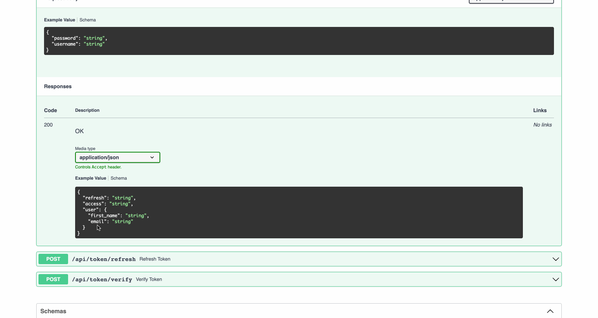

如果你希望自定义由 `NinjaJWTDefaultController` 和 `NinjaJWTSlidingController`
视图生成的网络令牌中包含的声明，为所需的控制器以及其相应的序列化器创建一个子类。以下是一个示例：

!!! 信息
如果你对该类的异步版本感兴趣，请使用 `AsyncNinjaJWTDefaultController` 和 `AsyncNinjaJWTSlidingController`。
此外请注意，它仅适用于支持异步操作的 Django 版本。

```python
from ninja_jwt.schema import TokenObtainPairInputSchema
from ninja_jwt.controller import TokenObtainPairController
from ninja_extra import api_controller, route
from ninja import Schema


class UserSchema(Schema):
    first_name: str
    email: str


class MyTokenObtainPairOutSchema(Schema):
    refresh: str
    access: str
    user: UserSchema


class MyTokenObtainPairSchema(TokenObtainPairInputSchema):
    def output_schema(self):
        out_dict = self.get_response_schema_init_kwargs()
        out_dict.update(user=UserSchema.from_orm(self._user))
        return MyTokenObtainPairOutSchema(**out_dict)


@api_controller('/token', tags=['Auth'])
class MyTokenObtainPairController(TokenObtainPairController):
    @route.post(
        "/pair", response=MyTokenObtainPairOutSchema, url_name="token_obtain_pair"
    )
    def obtain_token(self, user_token: MyTokenObtainPairSchema):
        return user_token.output_schema()

```

与标准控制器一样，你还需要按照 [入门指南](getting_started.md) 中所示注册该控制器

#### 使用 Django Ninja 路由器

如果你对使用函数而不是类感兴趣，那么你也可以。这里有一个例子

```python
from ninja_jwt.routers.blacklist import blacklist_router
from ninja_jwt.routers.obtain import obtain_pair_router, sliding_router
from ninja_jwt.routers.verify import verify_router
```

像这样注册 `router` 到 django-ninja 的 `api` 中:

```python
from ninja import NinjaAPI

api = NinjaAPI()
api.add_router('/token', tags=['Auth'], router=obtain_pair_router)
...
```

如果你对自定义令牌声明感兴趣，你可以通过创建 `TokenObtainPairInputSchema` 和 `TokenObtainPairController` 子类来实现。 请参阅 [控制器模式交换](#控制器模式交换)

此外，重要的是要注意 `NinjaExtra` 为 `APIException` 类注册了一个处理程序，而在 `NinjaAPI` 实例中是不可用的。
要解决这个问题，你需要下面的额外代码：

```python
from ninja import NinjaAPI
from ninja_extra import exceptions

api = NinjaAPI()
api.add_router('', tags=['Auth'], router=router)

def api_exception_handler(request, exc):
    headers = {}

    if isinstance(exc.detail, (list, dict)):
        data = exc.detail
    else:
        data = {"detail": exc.detail}

    response = api.create_response(request, data, status=exc.status_code)
    for k, v in headers.items():
        response.setdefault(k, v)

    return response

api.exception_handler(exceptions.APIException)(api_exception_handler)
```

### 控制器模式交换

现在你可以在 `NINJA_JWT` 设置中交换控制器模式，而无需继承或者覆盖 Ninja JWT 控制器功能。

所有控制器输入模式必须继承自 `ninja_jwt.schema.InputSchemaMixin` ，并且生成令牌的模式应该继承自
 `ninja_jwt.schema.TokenObtainInputSchemaBase` 或 `ninja_jwt.schema.TokenInputSchemaMixin`， 如果你想要有更多的控制权。

使用上面的例子：

```python
# project/schema.py
from typing import Type, Dict
from ninja_jwt.schema import TokenObtainInputSchemaBase
from ninja import Schema
from ninja_jwt.tokens import RefreshToken

class UserSchema(Schema):
    first_name: str
    email: str


class MyTokenObtainPairOutSchema(Schema):
    refresh: str
    access: str
    user: UserSchema


class MyTokenObtainPairInputSchema(TokenObtainInputSchemaBase):
    @classmethod
    def get_response_schema(cls) -> Type[Schema]:
        return MyTokenObtainPairOutSchema

    @classmethod
    def get_token(cls, user) -> Dict:
        values = {}
        refresh = RefreshToken.for_user(user)
        values["refresh"] = str(refresh)
        values["access"] = str(refresh.access_token)
        values.update(user=UserSchema.from_orm(user)) # this will be needed when creating output schema
        return values
```

在 `MyTokenObtainPairInputSchema` 我们重写了 `get_token` 方法来定义我们的令牌以及输出模式所需的一些数据。
我们还重写了 `get_response_schema` 方法来定义我们的输出模式 `MyTokenObtainPairOutSchema`。

接下来，我们将 `MyTokenObtainPairInputSchema` 模式应用于控制器。这可以在 `NINJA_JWT` 设置中简单地完成。

```python
# project/settings.py

NINJA_JWT = {
    'TOKEN_OBTAIN_PAIR_INPUT_SCHEMA': 'project.schema.MyTokenObtainPairInputSchema',
}
```
其他可交换的模式可以按照如下方式进行设置
```python
# project/settings.py

NINJA_JWT = {
    # FOR OBTAIN PAIR
    'TOKEN_OBTAIN_PAIR_INPUT_SCHEMA': "project.schema.MyTokenObtainPairInputSchema",
    'TOKEN_OBTAIN_PAIR_REFRESH_INPUT_SCHEMA': "for.obtain_pair.refresh_input.schema",
    # FOR SLIDING TOKEN
    'TOKEN_OBTAIN_SLIDING_INPUT_SCHEMA':  "for.obtain_sliding.input.schema",
    'TOKEN_OBTAIN_SLIDING_REFRESH_INPUT_SCHEMA': "for.obtain_pair.refresh_input.schema",

    'TOKEN_BLACKLIST_INPUT_SCHEMA':  "for.blacklist_input.schema",
    'TOKEN_VERIFY_INPUT_SCHEMA':  "for.verify_input.schema",
}
```



!!! 注意
   `Controller Schema Swapping` 只在 **v5.2.4** 以上版本可用


